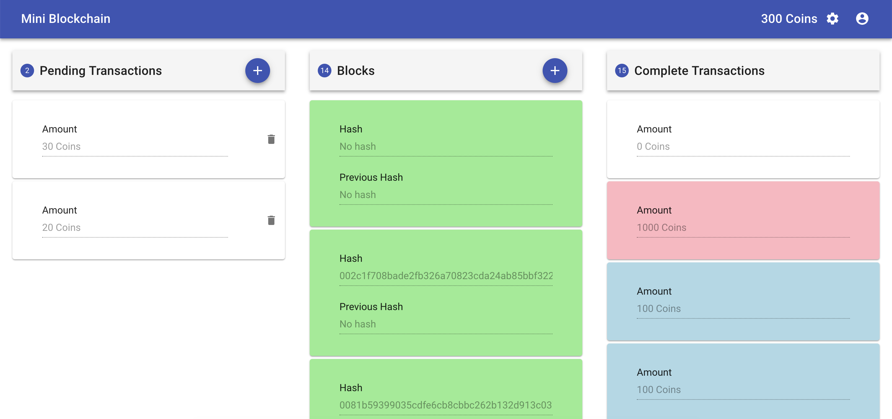

# Mini Blockchain




### Development

```
$ yarn
```

```
$ yarn start
```

### Tech Talk

- [Mini Blockchain at Mini Conf](https://www.youtube.com/watch?v=6gjEkcwjJUQ&feature=youtu.be&t=9125)

### TODO

- Unit Test with Jest
- UI Test with TestCafe
- Linter + Prettier + Husky hook
- P2P Connection
